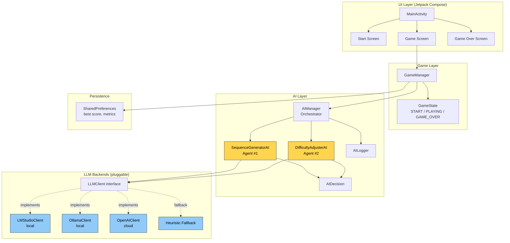

# MindRush AI -- Component Architecture

This document describes the high-level component architecture of the MindRush AI Android application.

## High-Level Architecture

## Layer Responsibilities

| Layer | Responsibility |
|---|---|
| **UI** | Renders screens with Jetpack Compose, captures user input. |
| **Game** | Manages game state machine, round progression, input validation, score persistence. |
| **AI** | Hosts the two AI agents, orchestrates their interaction with the game loop, logs decisions. |
| **LLM** | Pluggable LLM clients (LM Studio, Ollama, OpenAI) behind a single `LLMClient` interface, with rule-based fallback when no LLM is reachable. |
| **Persistence** | Stores best score and gameplay metrics in `SharedPreferences`. |

## Key Architectural Decisions

1. **Two cooperating AI agents**: `SequenceGeneratorAI` (decides *what* the next sequence should be) and `DifficultyAdjusterAI` (decides *how hard* it should be). Their outputs are combined by `AIManager`.
2. **LLM-agnostic design**: The agents call an abstract `LLMClient`. This lets us swap small local models (Ollama / LM Studio) without touching the agents themselves.
3. **Graceful degradation**: When no LLM backend is reachable, the agents fall back to deterministic heuristics so the game keeps working offline.
4. **Single Activity + Compose**: `MainActivity` is the only Activity; navigation between screens is handled in Compose state.
