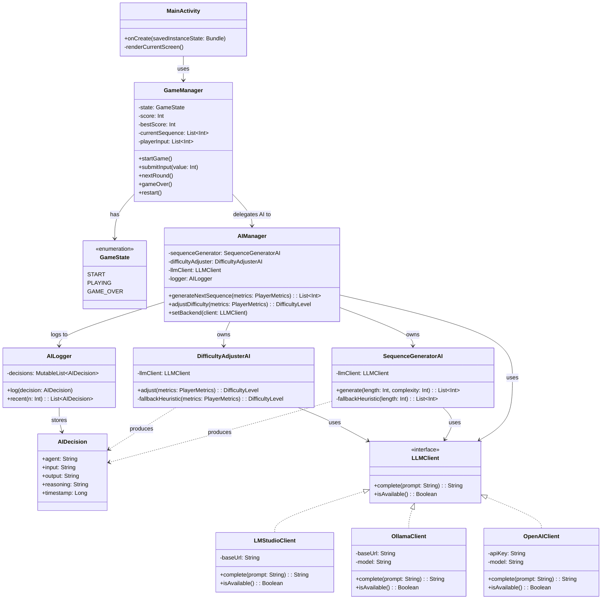

# MindRush AI -- UML Class Diagram

This diagram captures the main classes, interfaces and their relationships in the MindRush AI codebase.

## Notes

- **`LLMClient`** is the abstraction that lets the two AI agents stay independent of any specific LLM provider.
- **`AIDecision`** is a value object so each agent's output (and reasoning) can be logged uniformly through `AILogger`. This is what makes the AI behaviour explainable (EPIC 7 in the backlog).
- The dependency direction is **UI → Game → AI → LLM**, never the reverse. This keeps the AI layer testable in isolation.
