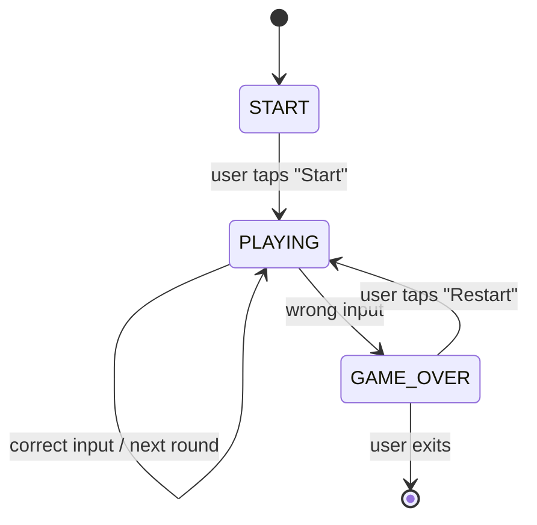
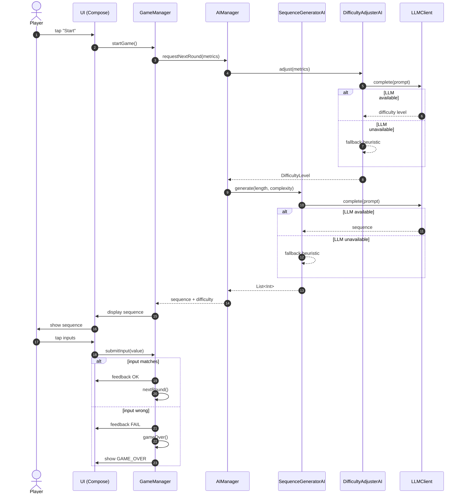
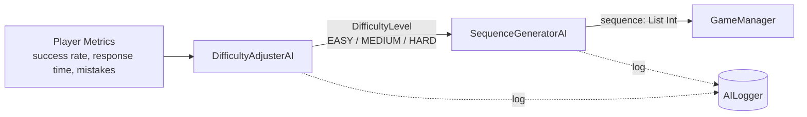

# MindRush AI -- Gameplay & AI Workflow

Sequence and state diagrams showing how a single round of MindRush AI plays out, including the interaction with the two AI agents.

## Game State Machine

## Round Sequence (with AI agents)

## AI Decision Pipeline (per round)

## Why two agents?

Splitting the AI into two cooperating agents matches the backlog requirement (EPIC 3 + EPIC 4) and gives us:

- **Separation of concerns**: one agent decides *how hard*, the other decides *what*.
- **Independent evaluation**: each agent can be eval-tested separately (see `docs/TESTING.md`).
- **Pluggability**: either agent can be swapped (e.g., heuristic-only vs LLM-backed) without touching the other.
